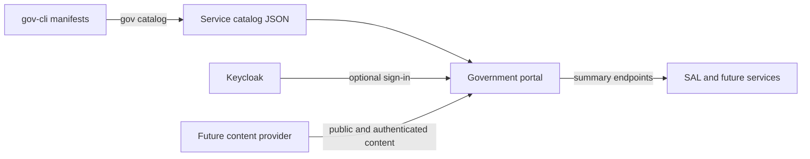

# Portal architecture

The government portal is an entrypoint, not a system of record. It has no application database and
does not perform operations owned by another service.

## Service catalog

Each application owns its name, description, URL, category, keywords, and public visibility in its
`*.gov.yaml` manifest. `gov catalog` validates these manifests and produces the runtime JSON catalog.
The portal searches and categorizes that catalog but does not maintain a second application registry.

## Personal overview

Authenticated blades implement `IPortalModule`. A module returns a small summary and a deep link. It
may call a purpose-built read-only summary endpoint using the user's access token. Failures must remain
isolated to that module, and operations continue in the owning application.

SAL should expose a current-user portal summary before its module displays live citizenship state. The
existing person-ID endpoints are not an appropriate portal integration contract.

## Content management

CMS content is a separate concern from the service catalog. Introduce it through an `IContentProvider`
only after these requirements are decided:

- localized content and fallback rules;
- draft, review, scheduled publication, and withdrawal workflow;
- public versus authenticated audience classification;
- editorial roles, immutable audit history, and approval separation;
- sanitization and a restricted block model rather than arbitrary executable HTML;
- caching and behavior when the CMS is unavailable.

A headless CMS is preferable to embedding authoring and persistence in the portal process. The portal
can remain database-free while privileged editors use the CMS's separately secured administration UI.
Private content must be filtered server-side; client-side hiding is not an authorization boundary.
